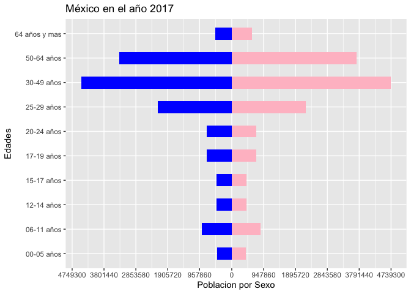
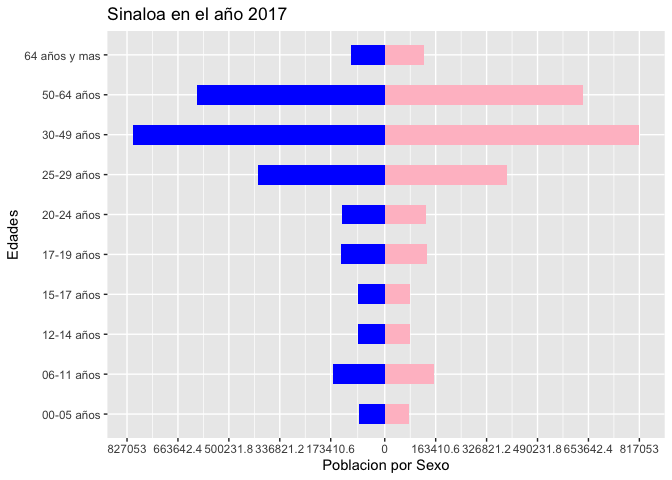

Creación de código
------------------

### Tasas

Primero cargamos los datos

    indicadores<-read_xlsx("Indicadores demográficos (1).xlsx")

Despues seleccionamos los datos de la republica en el año 2017, y los
acomodamos de una manera mas amigable, donde partimos de una tabla para
la población y una para defunciones, para juntarlas y hacer una tabla
general en la cual se incluye la tasa estandar de la población

    anio=2017
    edad<-c("00-05 años","06-11 años","12-14 años","15-17 años",
              "17-19 años","20-24 años","25-29 años","30-49 años",
              "50-64 años","64 años y mas")
    RepublicaPoblacion<-indicadores %>% filter(AÑO==anio,
                                                 ENTIDAD=="República Mexicana") %>% 
        select(starts_with("P")) %>% t() %>% 
        as.data.frame()%>%cbind(edad) 
      colnames(RepublicaPoblacion)=c("Poblacion","Edades")
      
    RepublicaDefuncion<-indicadores %>% filter(AÑO==anio,
                                                 ENTIDAD=="República Mexicana") %>% 
        select(starts_with("D")) %>% t() %>% 
        as.data.frame()%>%cbind(edad) 
      colnames(RepublicaDefuncion)=c("Defunciones","Edades")
      
    Republica<-Reduce(merge,list(RepublicaPoblacion,RepublicaDefuncion))
    Republica %<>%mutate(TasaEstandar=Defunciones/Poblacion*1000)

    Republica %>%head() %>% kable(format = "markdown") 

<table>
<thead>
<tr class="header">
<th style="text-align: left;">Edades</th>
<th style="text-align: right;">Poblacion</th>
<th style="text-align: right;">Defunciones</th>
<th style="text-align: right;">TasaEstandar</th>
</tr>
</thead>
<tbody>
<tr class="odd">
<td style="text-align: left;">00-05 años</td>
<td style="text-align: right;">6647805</td>
<td style="text-align: right;">58573</td>
<td style="text-align: right;">8.810878</td>
</tr>
<tr class="even">
<td style="text-align: left;">06-11 años</td>
<td style="text-align: right;">13367833</td>
<td style="text-align: right;">21965</td>
<td style="text-align: right;">1.643123</td>
</tr>
<tr class="odd">
<td style="text-align: left;">12-14 años</td>
<td style="text-align: right;">6715120</td>
<td style="text-align: right;">29286</td>
<td style="text-align: right;">4.361203</td>
</tr>
<tr class="even">
<td style="text-align: left;">15-17 años</td>
<td style="text-align: right;">6648426</td>
<td style="text-align: right;">36608</td>
<td style="text-align: right;">5.506266</td>
</tr>
<tr class="odd">
<td style="text-align: left;">17-19 años</td>
<td style="text-align: right;">11040395</td>
<td style="text-align: right;">73216</td>
<td style="text-align: right;">6.631647</td>
</tr>
<tr class="even">
<td style="text-align: left;">20-24 años</td>
<td style="text-align: right;">10905608</td>
<td style="text-align: right;">73216</td>
<td style="text-align: right;">6.713610</td>
</tr>
</tbody>
</table>

Ahora haremos una lista con data frames de cada uno de los estados
seleccionados los cuales son Jalisco,México,Sinaloa,Tlaxcala.

    estados<-c("Jalisco","México","Sinaloa","Tlaxcala")
    Tablas<-list()
    Tasas<-data.frame()

Hacemos un ciclo for para guardar los data frames de los datos en la
lista,adamemas para poner una tabla con las respectivas tasas de cada
estado

    for (i in 1:length(estados)) {
        edo<-indicadores %>% filter(AÑO==anio,ENTIDAD==estados[i])
    # mujeres  ----------------------------------------------------------------
        mujeres<-edo %>% select(starts_with("M")) %>%t() %>% 
          as.data.frame()%>%cbind(edad) 
        colnames(mujeres)=c("Mujeres","Edades")
    # hombres  ----------------------------------------------------------------  
        hombres<-edo %>% select(starts_with("H")) %>%t() %>% 
          as.data.frame()%>%cbind(edad) 
        colnames(hombres)=c("Hombres","Edades")
    # poblacion  ----------------------------------------------------------------    
        poblacion<-edo %>% select(starts_with("P")) %>%t() %>% 
          as.data.frame()%>%cbind(edad) 
        colnames(poblacion)=c("Poblacion","Edades")
    # Defunciones  ----------------------------------------------------------------  
        defunciones<-edo %>% select(starts_with("D")) %>%t() %>% 
          as.data.frame()%>%cbind(edad) 
        colnames(defunciones)=c("Defunciones","Edades")

    # Creacion de elementos de la lista con data frames   ----------------------------------------------------------------
        Tablas[[estados[i]]]=Reduce(merge,
                                    list(mujeres,hombres,poblacion,defunciones))
        Tablas[[estados[i]]] %<>% mutate(Defunciones_Esperadas=
                                           Poblacion*Republica$TasaEstandar/1000)

    # Calculo de tasas  -----------------------------------------------------------
        Tasabruta<-(sum(Tablas[[estados[i]]]$Defunciones)/sum(
          Tablas[[estados[i]]]$Poblacion))*1000
        
        FactordeAjuste=sum(Tablas[[estados[i]]]$Defunciones)/sum(
          Tablas[[estados[i]]]$Defunciones_Esperadas)
        
      TasaEstandarizada=1000*
        sum(Republica$Defunciones)/sum(Republica$Poblacion)*FactordeAjuste
      Tasas %<>% rbind(c(Tasabruta,FactordeAjuste,TasaEstandarizada)) 
    }
    colnames(Tasas)=c("Tasa bruta","Factor de Ajuste","Tasa Estandarizada")
    rownames(Tasas)=estados
    Tasas %<>%t() %>% as.data.frame() 

### Creacion de piramide

Primero creamos una lista donde guardameros todos los data frames
ajustados para poder hacer la piramide

    Piramide<-list()

Llenaremos la lista con un for ya con los datos ajustados

     for (i in 1:length(estados)) {
        ClasporSexo<-Tablas[[estados[i]]] %>% select(Edades,Mujeres,Hombres) %>% 
          pivot_longer(cols = c("Hombres","Mujeres"), 
                       names_to = "Sexo",
                       values_to = "Poblacion por Sexo")
        Piramide[[estados[i]]]=as.data.frame(ClasporSexo)
      }

Un ejemplo de como queda la tabla ya ajustada

    Piramide$Jalisco %>% head() %>% kable(format = "markdown")

<table>
<thead>
<tr class="header">
<th style="text-align: left;">Edades</th>
<th style="text-align: left;">Sexo</th>
<th style="text-align: right;">Poblacion por Sexo</th>
</tr>
</thead>
<tbody>
<tr class="odd">
<td style="text-align: left;">00-05 años</td>
<td style="text-align: left;">Hombres</td>
<td style="text-align: right;">226599</td>
</tr>
<tr class="even">
<td style="text-align: left;">00-05 años</td>
<td style="text-align: left;">Mujeres</td>
<td style="text-align: right;">219109</td>
</tr>
<tr class="odd">
<td style="text-align: left;">06-11 años</td>
<td style="text-align: left;">Hombres</td>
<td style="text-align: right;">453554</td>
</tr>
<tr class="even">
<td style="text-align: left;">06-11 años</td>
<td style="text-align: left;">Mujeres</td>
<td style="text-align: right;">439672</td>
</tr>
<tr class="odd">
<td style="text-align: left;">12-14 años</td>
<td style="text-align: left;">Hombres</td>
<td style="text-align: right;">227310</td>
</tr>
<tr class="even">
<td style="text-align: left;">12-14 años</td>
<td style="text-align: left;">Mujeres</td>
<td style="text-align: right;">219906</td>
</tr>
</tbody>
</table>

Ahora creamos una lista para guardar las graficas de cada estado

    Grafica<-list()

Ahora guardmos las graficas de cada estado en las lista

    for (i in 1:length(estados)) {
        x=Piramide[[estados[i]]]
        plt <- ggplot(x, aes(x = `Edades`,
                             y = `Poblacion por Sexo`,
                             fill = Sexo))+
          # Seccion de HOMBRES
          geom_col(data = subset(x, Sexo == "Hombres") %>% 
                     # Convertimos los datos de los Hombres en negativos
                     mutate(`Poblacion por Sexo` = -`Poblacion por Sexo`),
                   width = 0.5, fill = "blue") +
          # Seccion de MUJERES
          geom_col(data = subset(x, Sexo == "Mujeres"),
                   width = 0.5, fill = "pink") + 
          # Cambio de ejes de coordenadas
          coord_flip() + 
          scale_y_continuous(
            breaks = c(seq(-(max(x$`Poblacion por Sexo`)+10000), 
                           -50000, by = max(x$`Poblacion por Sexo`)/5), 
                       seq(0, max(x$`Poblacion por Sexo`)+10000, 
                           by = max(x$`Poblacion por Sexo`)/5)),
            labels = c(seq(-(max(x$`Poblacion por Sexo`)+10000), -50000, 
                           by = max(x$`Poblacion por Sexo`)/5) * -1, 
                       seq(0,max(x$`Poblacion por Sexo`)+10000, 
                           by =max(x$`Poblacion por Sexo`)/5)))+
          ggtitle(str_c(estados[i]," en el año ",anio))
        Grafica[[estados[i]]]=plt
      }

Resultados
----------

### Gráfiacas y tablas de cada estado

### Jalisco

##### Tabla

    Tablas$Jalisco %>% kable(format = "markdown")

<table>
<thead>
<tr class="header">
<th style="text-align: left;">Edades</th>
<th style="text-align: right;">Mujeres</th>
<th style="text-align: right;">Hombres</th>
<th style="text-align: right;">Poblacion</th>
<th style="text-align: right;">Defunciones</th>
<th style="text-align: right;">Defunciones_Esperadas</th>
</tr>
</thead>
<tbody>
<tr class="odd">
<td style="text-align: left;">00-05 años</td>
<td style="text-align: right;">219109</td>
<td style="text-align: right;">226599</td>
<td style="text-align: right;">445708</td>
<td style="text-align: right;">3716</td>
<td style="text-align: right;">3927.079</td>
</tr>
<tr class="even">
<td style="text-align: left;">06-11 años</td>
<td style="text-align: right;">439672</td>
<td style="text-align: right;">453554</td>
<td style="text-align: right;">893226</td>
<td style="text-align: right;">1394</td>
<td style="text-align: right;">1467.681</td>
</tr>
<tr class="odd">
<td style="text-align: left;">12-14 años</td>
<td style="text-align: right;">219906</td>
<td style="text-align: right;">227310</td>
<td style="text-align: right;">447216</td>
<td style="text-align: right;">1858</td>
<td style="text-align: right;">1950.400</td>
</tr>
<tr class="even">
<td style="text-align: left;">15-17 años</td>
<td style="text-align: right;">217720</td>
<td style="text-align: right;">225131</td>
<td style="text-align: right;">442851</td>
<td style="text-align: right;">2323</td>
<td style="text-align: right;">2438.455</td>
</tr>
<tr class="odd">
<td style="text-align: left;">17-19 años</td>
<td style="text-align: right;">361467</td>
<td style="text-align: right;">374212</td>
<td style="text-align: right;">735679</td>
<td style="text-align: right;">4646</td>
<td style="text-align: right;">4878.763</td>
</tr>
<tr class="even">
<td style="text-align: left;">20-24 años</td>
<td style="text-align: right;">357857</td>
<td style="text-align: right;">370603</td>
<td style="text-align: right;">728460</td>
<td style="text-align: right;">4646</td>
<td style="text-align: right;">4890.596</td>
</tr>
<tr class="odd">
<td style="text-align: left;">25-29 años</td>
<td style="text-align: right;">1064622</td>
<td style="text-align: right;">1092774</td>
<td style="text-align: right;">2157396</td>
<td style="text-align: right;">4646</td>
<td style="text-align: right;">4888.040</td>
</tr>
<tr class="even">
<td style="text-align: left;">30-49 años</td>
<td style="text-align: right;">2199726</td>
<td style="text-align: right;">2154455</td>
<td style="text-align: right;">4354181</td>
<td style="text-align: right;">3252</td>
<td style="text-align: right;">3379.608</td>
</tr>
<tr class="odd">
<td style="text-align: left;">50-64 años</td>
<td style="text-align: right;">1660405</td>
<td style="text-align: right;">1538357</td>
<td style="text-align: right;">3198762</td>
<td style="text-align: right;">6039</td>
<td style="text-align: right;">6134.271</td>
</tr>
<tr class="even">
<td style="text-align: left;">64 años y mas</td>
<td style="text-align: right;">309976</td>
<td style="text-align: right;">255123</td>
<td style="text-align: right;">565099</td>
<td style="text-align: right;">13937</td>
<td style="text-align: right;">14151.473</td>
</tr>
</tbody>
</table>

##### Gráfica

    Grafica$Jalisco

### México

##### Tabla

    Tablas$México %>% kable(format = "markdown")

<table>
<thead>
<tr class="header">
<th style="text-align: left;">Edades</th>
<th style="text-align: right;">Mujeres</th>
<th style="text-align: right;">Hombres</th>
<th style="text-align: right;">Poblacion</th>
<th style="text-align: right;">Defunciones</th>
<th style="text-align: right;">Defunciones_Esperadas</th>
</tr>
</thead>
<tbody>
<tr class="odd">
<td style="text-align: left;">00-05 años</td>
<td style="text-align: right;">416531</td>
<td style="text-align: right;">436179</td>
<td style="text-align: right;">852710</td>
<td style="text-align: right;">7233</td>
<td style="text-align: right;">7513.124</td>
</tr>
<tr class="even">
<td style="text-align: left;">06-11 años</td>
<td style="text-align: right;">854672</td>
<td style="text-align: right;">890185</td>
<td style="text-align: right;">1744857</td>
<td style="text-align: right;">2712</td>
<td style="text-align: right;">2867.015</td>
</tr>
<tr class="odd">
<td style="text-align: left;">12-14 años</td>
<td style="text-align: right;">437332</td>
<td style="text-align: right;">452793</td>
<td style="text-align: right;">890125</td>
<td style="text-align: right;">3617</td>
<td style="text-align: right;">3882.016</td>
</tr>
<tr class="even">
<td style="text-align: left;">15-17 años</td>
<td style="text-align: right;">438387</td>
<td style="text-align: right;">450377</td>
<td style="text-align: right;">888764</td>
<td style="text-align: right;">4521</td>
<td style="text-align: right;">4893.771</td>
</tr>
<tr class="odd">
<td style="text-align: left;">17-19 años</td>
<td style="text-align: right;">730585</td>
<td style="text-align: right;">749475</td>
<td style="text-align: right;">1480060</td>
<td style="text-align: right;">9042</td>
<td style="text-align: right;">9815.235</td>
</tr>
<tr class="even">
<td style="text-align: left;">20-24 años</td>
<td style="text-align: right;">738061</td>
<td style="text-align: right;">747078</td>
<td style="text-align: right;">1485139</td>
<td style="text-align: right;">9042</td>
<td style="text-align: right;">9970.644</td>
</tr>
<tr class="odd">
<td style="text-align: left;">25-29 años</td>
<td style="text-align: right;">2196480</td>
<td style="text-align: right;">2205715</td>
<td style="text-align: right;">4402195</td>
<td style="text-align: right;">9042</td>
<td style="text-align: right;">9974.110</td>
</tr>
<tr class="even">
<td style="text-align: left;">30-49 años</td>
<td style="text-align: right;">4739300</td>
<td style="text-align: right;">4479990</td>
<td style="text-align: right;">9219290</td>
<td style="text-align: right;">6329</td>
<td style="text-align: right;">7155.785</td>
</tr>
<tr class="odd">
<td style="text-align: left;">50-64 años</td>
<td style="text-align: right;">3714861</td>
<td style="text-align: right;">3338553</td>
<td style="text-align: right;">7053414</td>
<td style="text-align: right;">11754</td>
<td style="text-align: right;">13526.343</td>
</tr>
<tr class="even">
<td style="text-align: left;">64 años y mas</td>
<td style="text-align: right;">594812</td>
<td style="text-align: right;">482878</td>
<td style="text-align: right;">1077690</td>
<td style="text-align: right;">27125</td>
<td style="text-align: right;">26988.016</td>
</tr>
</tbody>
</table>

##### Gráfica

    Grafica$México

### Sinaloa

##### Tabla

    Tablas$Sinaloa %>% kable(format = "markdown")

<table>
<thead>
<tr class="header">
<th style="text-align: left;">Edades</th>
<th style="text-align: right;">Mujeres</th>
<th style="text-align: right;">Hombres</th>
<th style="text-align: right;">Poblacion</th>
<th style="text-align: right;">Defunciones</th>
<th style="text-align: right;">Defunciones_Esperadas</th>
</tr>
</thead>
<tbody>
<tr class="odd">
<td style="text-align: left;">00-05 años</td>
<td style="text-align: right;">77484</td>
<td style="text-align: right;">81285</td>
<td style="text-align: right;">158769</td>
<td style="text-align: right;">1524</td>
<td style="text-align: right;">1398.8943</td>
</tr>
<tr class="even">
<td style="text-align: left;">06-11 años</td>
<td style="text-align: right;">158681</td>
<td style="text-align: right;">167136</td>
<td style="text-align: right;">325817</td>
<td style="text-align: right;">572</td>
<td style="text-align: right;">535.3576</td>
</tr>
<tr class="odd">
<td style="text-align: left;">12-14 años</td>
<td style="text-align: right;">81314</td>
<td style="text-align: right;">85610</td>
<td style="text-align: right;">166924</td>
<td style="text-align: right;">762</td>
<td style="text-align: right;">727.9894</td>
</tr>
<tr class="even">
<td style="text-align: left;">15-17 años</td>
<td style="text-align: right;">81302</td>
<td style="text-align: right;">85312</td>
<td style="text-align: right;">166614</td>
<td style="text-align: right;">953</td>
<td style="text-align: right;">917.4210</td>
</tr>
<tr class="odd">
<td style="text-align: left;">17-19 años</td>
<td style="text-align: right;">135125</td>
<td style="text-align: right;">141846</td>
<td style="text-align: right;">276971</td>
<td style="text-align: right;">1906</td>
<td style="text-align: right;">1836.7738</td>
</tr>
<tr class="even">
<td style="text-align: left;">20-24 años</td>
<td style="text-align: right;">132429</td>
<td style="text-align: right;">138571</td>
<td style="text-align: right;">271000</td>
<td style="text-align: right;">1906</td>
<td style="text-align: right;">1819.3883</td>
</tr>
<tr class="odd">
<td style="text-align: left;">25-29 años</td>
<td style="text-align: right;">392244</td>
<td style="text-align: right;">406999</td>
<td style="text-align: right;">799243</td>
<td style="text-align: right;">1906</td>
<td style="text-align: right;">1810.8552</td>
</tr>
<tr class="even">
<td style="text-align: left;">30-49 años</td>
<td style="text-align: right;">817053</td>
<td style="text-align: right;">808651</td>
<td style="text-align: right;">1625704</td>
<td style="text-align: right;">1334</td>
<td style="text-align: right;">1261.8312</td>
</tr>
<tr class="odd">
<td style="text-align: left;">50-64 años</td>
<td style="text-align: right;">637213</td>
<td style="text-align: right;">600981</td>
<td style="text-align: right;">1238194</td>
<td style="text-align: right;">2477</td>
<td style="text-align: right;">2374.4865</td>
</tr>
<tr class="even">
<td style="text-align: left;">64 años y mas</td>
<td style="text-align: right;">124400</td>
<td style="text-align: right;">108741</td>
<td style="text-align: right;">233141</td>
<td style="text-align: right;">5717</td>
<td style="text-align: right;">5838.4257</td>
</tr>
</tbody>
</table>

##### Gráfica

    Grafica$Sinaloa

### Tlaxcala

##### Tabla

    Tablas$Tlaxcala %>% kable(format = "markdown")

<table>
<thead>
<tr class="header">
<th style="text-align: left;">Edades</th>
<th style="text-align: right;">Mujeres</th>
<th style="text-align: right;">Hombres</th>
<th style="text-align: right;">Poblacion</th>
<th style="text-align: right;">Defunciones</th>
<th style="text-align: right;">Defunciones_Esperadas</th>
</tr>
</thead>
<tbody>
<tr class="odd">
<td style="text-align: left;">00-05 años</td>
<td style="text-align: right;">35725</td>
<td style="text-align: right;">37340</td>
<td style="text-align: right;">73065</td>
<td style="text-align: right;">599</td>
<td style="text-align: right;">643.7668</td>
</tr>
<tr class="even">
<td style="text-align: left;">06-11 años</td>
<td style="text-align: right;">72626</td>
<td style="text-align: right;">75843</td>
<td style="text-align: right;">148469</td>
<td style="text-align: right;">225</td>
<td style="text-align: right;">243.9529</td>
</tr>
<tr class="odd">
<td style="text-align: left;">12-14 años</td>
<td style="text-align: right;">36841</td>
<td style="text-align: right;">38379</td>
<td style="text-align: right;">75220</td>
<td style="text-align: right;">299</td>
<td style="text-align: right;">328.0497</td>
</tr>
<tr class="even">
<td style="text-align: left;">15-17 años</td>
<td style="text-align: right;">36535</td>
<td style="text-align: right;">37769</td>
<td style="text-align: right;">74304</td>
<td style="text-align: right;">374</td>
<td style="text-align: right;">409.1376</td>
</tr>
<tr class="odd">
<td style="text-align: left;">17-19 años</td>
<td style="text-align: right;">60616</td>
<td style="text-align: right;">62542</td>
<td style="text-align: right;">123158</td>
<td style="text-align: right;">749</td>
<td style="text-align: right;">816.7404</td>
</tr>
<tr class="even">
<td style="text-align: left;">20-24 años</td>
<td style="text-align: right;">59738</td>
<td style="text-align: right;">60507</td>
<td style="text-align: right;">120245</td>
<td style="text-align: right;">749</td>
<td style="text-align: right;">807.2780</td>
</tr>
<tr class="odd">
<td style="text-align: left;">25-29 años</td>
<td style="text-align: right;">178050</td>
<td style="text-align: right;">178611</td>
<td style="text-align: right;">356661</td>
<td style="text-align: right;">749</td>
<td style="text-align: right;">808.0915</td>
</tr>
<tr class="even">
<td style="text-align: left;">30-49 años</td>
<td style="text-align: right;">370606</td>
<td style="text-align: right;">345488</td>
<td style="text-align: right;">716094</td>
<td style="text-align: right;">524</td>
<td style="text-align: right;">555.8144</td>
</tr>
<tr class="odd">
<td style="text-align: left;">50-64 años</td>
<td style="text-align: right;">277225</td>
<td style="text-align: right;">242488</td>
<td style="text-align: right;">519713</td>
<td style="text-align: right;">973</td>
<td style="text-align: right;">996.6544</td>
</tr>
<tr class="even">
<td style="text-align: left;">64 años y mas</td>
<td style="text-align: right;">46305</td>
<td style="text-align: right;">39030</td>
<td style="text-align: right;">85335</td>
<td style="text-align: right;">2246</td>
<td style="text-align: right;">2136.9989</td>
</tr>
</tbody>
</table>

##### Gráfica

    Grafica$Tlaxcala

### Concluciones sobre las piramides

Podemos observar en la pirámide poblacional referente al año 2017
correspondiente a los estados de Jalisco, Estado de México, Tlaxcala y
Sinaloa, que presentan una base estrecha y la cúspide un poco más
dilatada con lo que podemos considerar una estructura de población
adulta (aproximadamente de entre 25 a 64 años) debido a que se observa
una baja fecundidad en este año. En este caso, lo menores de 20 años
representan aproximadamente sólo el 20 % de la población total de los 4
estados antes mencionados, los ancianos menos del 10% y la población
adulta más del 70%.

Tasas
-----

    Tasas %>% kable(format = "markdown")

<table>
<thead>
<tr class="header">
<th style="text-align: left;"></th>
<th style="text-align: right;">Jalisco</th>
<th style="text-align: right;">México</th>
<th style="text-align: right;">Sinaloa</th>
<th style="text-align: right;">Tlaxcala</th>
</tr>
</thead>
<tbody>
<tr class="odd">
<td style="text-align: left;">Tasa bruta</td>
<td style="text-align: right;">3.3258217</td>
<td style="text-align: right;">3.1077281</td>
<td style="text-align: right;">3.621367</td>
<td style="text-align: right;">3.2662032</td>
</tr>
<tr class="even">
<td style="text-align: left;">Factor de Ajuste</td>
<td style="text-align: right;">0.9657142</td>
<td style="text-align: right;">0.9361289</td>
<td style="text-align: right;">1.028917</td>
<td style="text-align: right;">0.9665029</td>
</tr>
<tr class="odd">
<td style="text-align: left;">Tasa Estandarizada</td>
<td style="text-align: right;">3.3340118</td>
<td style="text-align: right;">3.2318721</td>
<td style="text-align: right;">3.552211</td>
<td style="text-align: right;">3.3367348</td>
</tr>
</tbody>
</table>

### Concluciones sobre las tasas

Si observamos las tasas brutas obtenidas para cada uno de los estados
podemos observar que estos tienen un comportamiento muy similar en
cuanto a mortalidad durante el año 2017. El estado que tiene una
mortalidad más alta es Sinaloa y el estado con mortalidad mas baja es el
Estado de México. Ahora bien, si quitamos el efecto por distribución de
edad, al obtener nuestras tasas estandarizadas podemos darnos cuenta de
que los resultados no cambian mucho a los de las tasas brutas. Por lo
que podemos concluir que para año 2017 en los estados de Jalisco,
Sinaloa, Estado de México y Tlaxcala la mortalidad es muy similar.

